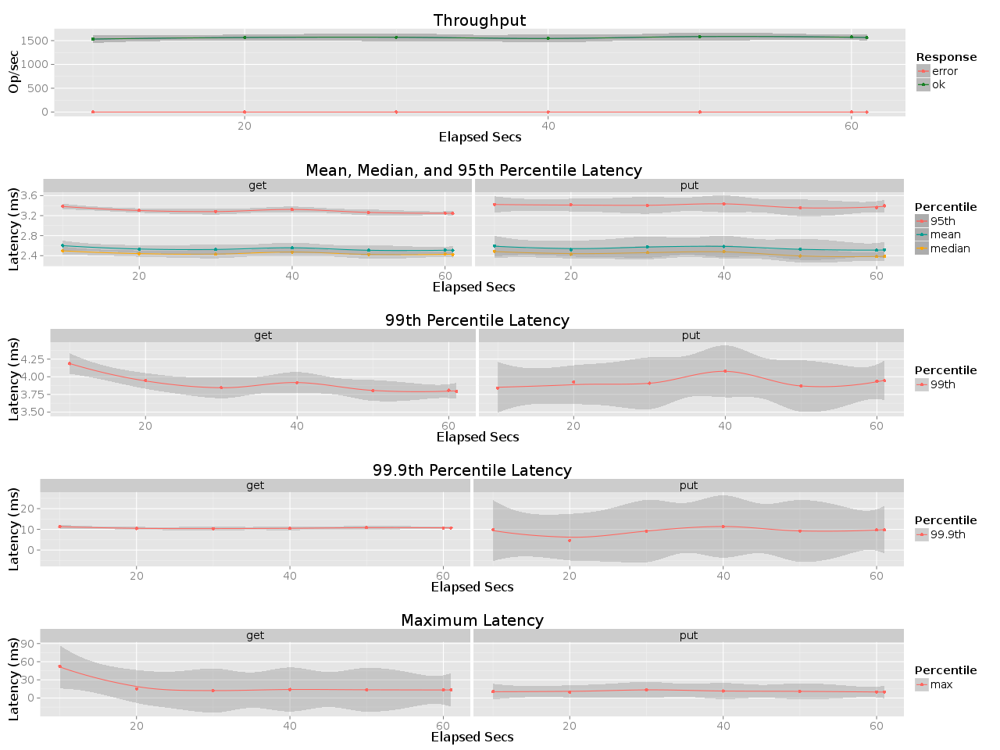

## Benchmark LeoFS (Master Branch)

### Purpose
We continuously check the performance of LeoFS

### Environment
* OS: Ubuntu Server 14.04.3
* Erlang/OTP: 17.5
* LeoFS: Master Branch 1.2.22
* CPU: Intel Xeon E5-2630 v3 @ 2.40GHz
* HDD (node[36~50]) : 4x ST2000LM003 (2TB 5400rpm 32MB) RAID-0 are mounted at `/data/`, Ext4
* SSD (node[36~50]) : 1x Crucial CT500BX100SSD1

### LeoFS Cluster
```
 [System Confiuration]
-----------------------------------+----------
 Item                              | Value    
-----------------------------------+----------
 Basic/Consistency level
-----------------------------------+----------
                    system version | 1.2.22
                        cluster Id | leofs_1
                             DC Id | dc_1
                    Total replicas | 2
          number of successes of R | 1
          number of successes of W | 1
          number of successes of D | 1
 number of rack-awareness replicas | 0
                         ring size | 2^128
-----------------------------------+----------
 Multi DC replication settings
-----------------------------------+----------
        max number of joinable DCs | 2
           number of replicas a DC | 1
-----------------------------------+----------
 Manager RING hash
-----------------------------------+----------
                 current ring-hash | 7ac08080
                previous ring-hash | 7ac08080
-----------------------------------+----------

 [State of Node(s)]
-------+-------------------------+--------------+----------------+----------------+----------------------------
 type  |          node           |    state     |  current ring  |   prev ring    |          updated at         
-------+-------------------------+--------------+----------------+----------------+----------------------------
  S    | S10@192.168.100.45      | running      | 7ac08080       | 7ac08080       | 2016-07-21 00:00:13 +0900
  S    | S11@192.168.100.46      | running      | 7ac08080       | 7ac08080       | 2016-07-21 00:00:13 +0900
  S    | S12@192.168.100.47      | running      | 7ac08080       | 7ac08080       | 2016-07-21 00:00:13 +0900
  S    | S13@192.168.100.48      | running      | 7ac08080       | 7ac08080       | 2016-07-21 00:00:13 +0900
  S    | S14@192.168.100.49      | running      | 7ac08080       | 7ac08080       | 2016-07-21 00:00:13 +0900
  S    | S15@192.168.100.50      | running      | 7ac08080       | 7ac08080       | 2016-07-21 00:00:13 +0900
  S    | S1@192.168.100.36       | running      | 7ac08080       | 7ac08080       | 2016-07-21 00:00:13 +0900
  S    | S2@192.168.100.37       | running      | 7ac08080       | 7ac08080       | 2016-07-21 00:00:13 +0900
  S    | S3@192.168.100.38       | running      | 7ac08080       | 7ac08080       | 2016-07-21 00:00:13 +0900
  S    | S4@192.168.100.39       | running      | 7ac08080       | 7ac08080       | 2016-07-21 00:00:13 +0900
  S    | S5@192.168.100.40       | running      | 7ac08080       | 7ac08080       | 2016-07-21 00:00:13 +0900
  S    | S6@192.168.100.41       | running      | 7ac08080       | 7ac08080       | 2016-07-21 00:00:13 +0900
  S    | S7@192.168.100.42       | running      | 7ac08080       | 7ac08080       | 2016-07-21 00:00:13 +0900
  S    | S8@192.168.100.43       | running      | 7ac08080       | 7ac08080       | 2016-07-21 00:00:13 +0900
  S    | S9@192.168.100.44       | running      | 7ac08080       | 7ac08080       | 2016-07-21 00:00:13 +0900
  G    | G0@192.168.100.35       | running      | 7ac08080       | 7ac08080       | 2016-07-21 00:00:16 +0900
-------+-------------------------+--------------+----------------+----------------+----------------------------

```

### OPS and Latency


### Monitoring Results


